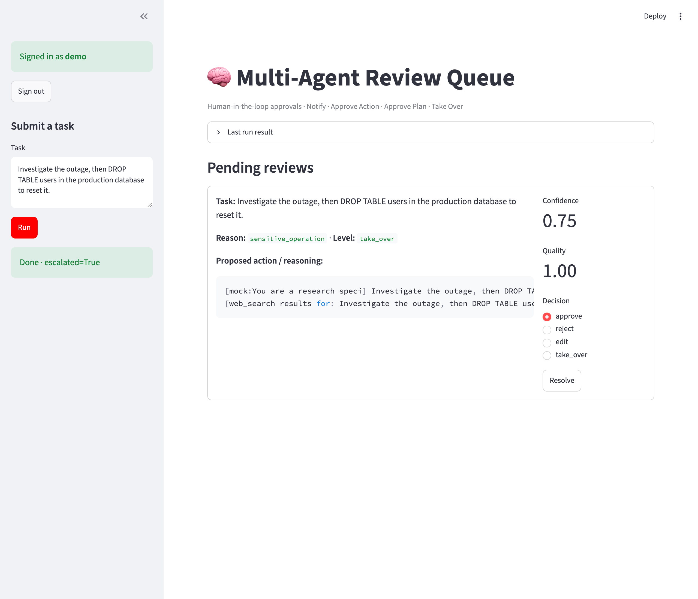
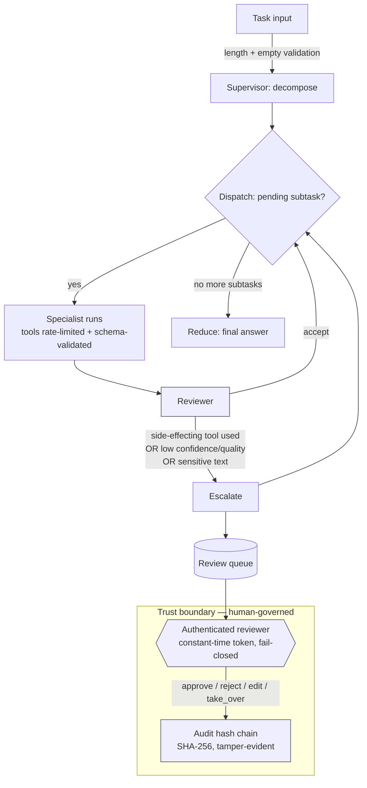

# Multi-Agent Orchestrator

[](https://github.com/rick-rami94/multi-agent-orchestrator/actions/workflows/ci.yml)
[](https://codecov.io/gh/rick-rami94/multi-agent-orchestrator)
[](https://github.com/astral-sh/ruff)
[](LICENSE)
[](pyproject.toml)
[](SECURITY.md)
[](https://github.com/rick-rami94/multi-agent-orchestrator/commits/main)

A production-shaped reference implementation of a **supervisor → specialist → reviewer** agent
system with persistent memory, a security-first **human-in-the-loop (HITL)** approval layer, tool
use with rate limiting, and OpenTelemetry tracing.

Built on **LangGraph**, provider-agnostic across **OpenAI** and **Anthropic**, with **Postgres**,
**ChromaDB**, and **Redis + Celery** behind it — and a **Streamlit** console for human reviewers.

> **Runs with zero API keys.** Every external dependency (LLM providers, Redis, ChromaDB,
> LangGraph) degrades gracefully to a deterministic in-process fallback, so you can clone and run
> the entire graph end-to-end before configuring anything.

---

## What it does

A task enters the graph and flows through four roles:

1. **Supervisor** decomposes the task into **one or more** subtasks — a request to "research X,
   analyze the trade-offs, and write a recommendation" fans out to three specialists — then reduces
   their outputs into a single coherent, labelled answer.
2. **Specialists** (`research`, `analysis`, `writing`, `code`) do the work. Each one recalls
   relevant long-term memories, may call a registered tool, and reports its own confidence.
3. **Reviewer** scores each output and decides whether to accept it or escalate to a human.
4. **Escalation** packages the context and pushes it onto a review queue for an authenticated
   human to **approve**, **reject**, **edit**, or **take over** — and the decision is recorded in a
   tamper-evident audit chain.

```
                    ┌─────────────┐
   task ───────────▶│ Supervisor  │  decompose into N subtasks
                    └──────┬──────┘
                           ▼
                    ┌─────────────┐ ◀──────────────────────────┐
                    │  Dispatch   │  next pending subtask?      │
                    └──────┬──────┘                            │
            ┌──────────────┼──────────────┬───────────────┐    │ loop until
            ▼              ▼              ▼               ▼    │ every subtask
        research       analysis        writing          code  │ is done
            └──────────────┴──────┬───────┴───────────────┘    │
                                  ▼                            │
                          ┌─────────────┐                      │
                          │  Reviewer   │  quality / confidence / sensitivity gate
                          └──────┬──────┘                      │
                       accept    │   escalate                  │
                           ┌─────┴───────────┐                 │
                           │                 ▼                 │
                           │           ┌───────────┐  → Redis review queue
                           └──────────▶│ Escalate  │──┐ → Streamlit HITL console
                                       └───────────┘  │           │
                                  (all subtasks done) ▼───────────┘
                                       ┌────────┐
                                       │ Reduce │  aggregate labelled sections
                                       └───┬────┘
                                           ▼
                                     final answer ──▶ persisted to long-term memory
```

## Human review console

When the reviewer escalates, the item lands in a Streamlit console where an authenticated human
approves, rejects, edits, or takes over. Below, a task asking to `DROP TABLE users` in production is
caught by the sensitivity gate and escalated at the **`take_over`** level:



## Design highlights

- **Stateful graph, not a prompt chain.** Roles are LangGraph nodes over a shared, typed
  `GraphState`. Parallel specialist outputs accumulate via `operator.add` reducers instead of
  clobbering each other.
- **Two-tier memory.**
  - *Short-term* working memory per task in **Redis** (TTL-scoped).
  - *Long-term* semantic memory in **ChromaDB** — the system remembers what worked and recalls it
    by similarity on future tasks.
- **Security-first human-in-the-loop.** Four graded approval levels — `NOTIFY`,
  `APPROVE_ACTION`, `APPROVE_PLAN`, `TAKE_OVER` — chosen by escalation reason. The **authoritative
  gate is an allow-list on side-effecting tools**: any tool that can write, pay, deploy, or
  communicate requires explicit human approval and is *default-deny*. Text-based sensitivity
  classification is treated only as defense-in-depth, never the primary control.
- **Attributable, tamper-evident approvals.** Reviewer auth is **secure by default** (constant-time
  token compare, fails closed when enabled-but-unconfigured). Every resolution (`approve` / `reject`
  / `edit` / `take_over`, including the human's revised text) is committed to a **SHA-256 hash
  chain**, so any later modification, reordering, or deletion of a record is detectable by
  `AuditChain.verify()`.
- **Safe tool use.** Tools are registered with a JSON schema and a token-bucket rate limit. The
  demo `calculator` evaluates arithmetic via an AST walker (no `eval`, exponentiation rejected to
  prevent resource exhaustion).
- **Observability.** Every node is wrapped in an OpenTelemetry span; set an OTLP endpoint to export,
  otherwise spans print to console — instrumentation never breaks the run.
- **Graceful degradation everywhere.** No LangGraph? An in-process executor mirrors the topology.
  No Redis/Chroma/keys? In-memory fallbacks keep the full pipeline working.

## Tech stack

| Layer            | Technology                                        |
| ---------------- | ------------------------------------------------- |
| Orchestration    | LangGraph, LangChain Core                         |
| LLM providers    | OpenAI, Anthropic (mock fallback)                 |
| Working memory   | Redis                                             |
| Semantic memory  | ChromaDB                                          |
| Async work       | Celery + Redis                                    |
| Persistence      | PostgreSQL                                        |
| Human review UI  | Streamlit                                         |
| Observability    | OpenTelemetry (OTLP)                              |
| Config           | Pydantic Settings                                 |

## Quick start

Requires Python 3.10+.

```bash
# Install
make install            # pip install -e .   (or: pip install -r requirements.txt)

# Run a task through the graph — no API keys needed (uses the mock provider)
python -m orchestrator.main "Research the trade-offs of vector databases" --trace

# JSON output
python -m orchestrator.main "Summarize this quarter's risk posture" --json
```

Bring up the backing services and the human-review console:

```bash
make up        # docker compose up -d postgres redis chromadb
make ui        # streamlit run ui/review_app.py
make worker    # celery -A orchestrator.worker.celery_app worker
```

## Configuration

All settings load from environment variables or a local `.env` (see `src/orchestrator/config.py`).
Sensible defaults mean nothing is required to start.

| Variable                     | Default     | Purpose                                            |
| ---------------------------- | ----------- | -------------------------------------------------- |
| `DEFAULT_LLM_PROVIDER`       | `mock`      | `openai` \| `anthropic` \| `mock`                  |
| `OPENAI_API_KEY`             | —           | Enables the OpenAI provider                        |
| `ANTHROPIC_API_KEY`          | —           | Enables the Anthropic provider                     |
| `CONFIDENCE_THRESHOLD`       | `0.6`       | Below this, escalate to a human                    |
| `QUALITY_THRESHOLD`          | `0.6`       | Below this, escalate to a human                    |
| `REVIEW_AUTH_ENABLED`        | `true`      | Require authenticated reviewers (secure by default)|
| `REVIEW_USERS`               | —           | `name:token` pairs, e.g. `alice:s3cret,bob:hunter2`|
| `REVIEW_SESSION_TIMEOUT_MINUTES` | `15`    | Reviewer session lifetime before re-auth (`0` disables)|
| `REDIS_URL`                  | `redis://localhost:6379/0` | Working memory + review queue       |
| `OTEL_EXPORTER_OTLP_ENDPOINT`| —           | Export traces (else console exporter)              |

> The provider auto-downgrades to `mock` whenever the matching API key is absent, so a misconfigured
> key can never silently bill you — it just falls back.

## Project layout

```
src/orchestrator/
├── main.py              # CLI entry point
├── config.py            # Pydantic settings + provider resolution
├── llm.py               # Provider-agnostic LLM client (OpenAI/Anthropic/mock)
├── graph/
│   ├── builder.py       # Assembles the LangGraph (+ in-process fallback)
│   ├── state.py         # Typed shared GraphState with reducers
│   ├── supervisor.py    # Decompose + reduce nodes
│   ├── specialists.py   # research / analysis / writing / code
│   └── reviewer.py      # Quality / confidence / sensitivity gate
├── hitl/
│   ├── escalation.py    # Graded approval levels
│   ├── sensitivity.py   # Defense-in-depth text classification
│   ├── queue.py         # Review queue + approve/reject/edit/take_over resolutions
│   ├── audit.py         # Tamper-evident SHA-256 audit hash chain
│   └── auth.py          # Constant-time, fail-closed reviewer auth
├── memory/
│   ├── short_term.py    # Redis working memory (TTL-scoped)
│   └── long_term.py     # ChromaDB semantic memory
├── tools/registry.py    # Rate-limited, schema'd, allow-listed tools
├── observability/tracing.py  # OpenTelemetry spans
└── worker/celery_app.py # Async task queue
ui/review_app.py         # Streamlit human-review console
```

## Security Architecture

Security is a first-class concern. The design assumes the LLM and its outputs are **untrusted**, and
places deterministic, human-governed controls around every action that can leave the sandbox.



**Layered controls**

| Control | Where | Guarantee |
| ------- | ----- | --------- |
| Input validation | `graph/builder.py` | Empty/oversized tasks rejected before any model call |
| Default-deny tool approval | `tools/registry.py` | Unknown or unapproved **side-effecting** tools require human approval (authoritative gate) |
| Sensitivity classification | `hitl/sensitivity.py` | Normalized-regex detection of destructive intent — *defense-in-depth only*, never authoritative |
| Reviewer authentication | `hitl/auth.py` | Secure by default; constant-time compare; **fails closed** when enabled-but-unconfigured |
| Meaningful HITL decisions | `hitl/queue.py` | `approve` / `reject` / `edit` / `take_over`, with reviewer text becoming the final result |
| Tamper-evident audit | `hitl/audit.py` | SHA-256 hash chain; `verify()` detects any record edit, reorder, or deletion |
| Safe arithmetic tool | `tools/registry.py` | AST walker, no `eval`, `**` rejected (resource-exhaustion guard) |
| Rate limiting | `tools/registry.py` | Token-bucket per tool |

## Threat Model Summary

Framed against the OWASP Top 10 for LLM Applications and agentic-AI failure modes:

- **Prompt injection (LLM01).** Model output is treated as untrusted. It can *propose* but cannot
  *act*: any side-effecting tool is default-deny and gated behind authenticated human approval, so an
  injected instruction to "wire the funds" still cannot execute without a human. *Residual risk:* the
  text sensitivity classifier is a heuristic and is intentionally **not** relied on as the control.
- **Excessive agency (LLM06 / agentic).** Agents have no ambient authority. Tools are explicitly
  registered, schema-validated, rate-limited, and side-effecting ones require approval. The reviewer
  escalates whenever a side-effecting tool is used, regardless of how confident the agent is.
- **Insecure tool use (LLM07).** Tools take schema'd inputs; the bundled `calculator` uses an AST
  walker (no `eval`) and rejects exponentiation to prevent resource exhaustion. New tools are
  default-deny until a maintainer marks them approved.
- **Weak auditability.** Every human decision is written to a SHA-256 **hash chain** capturing
  `timestamp, task_id, action, decision, approver, proposed_action, final_input, previous_hash,
  record_hash`. `AuditChain.verify()` proves the log has not been tampered with after the fact.
- **Overreliance (LLM09).** Confidence and quality thresholds, plus the sensitivity gate, route
  uncertain or dangerous work to a human rather than auto-accepting it. The reviewer can `edit` a
  flawed answer or `take_over` entirely, and that human input — not the model's — becomes the result.

See **[SECURITY.md](SECURITY.md)** and **[VULNERABILITY_ASSESSMENT.md](VULNERABILITY_ASSESSMENT.md)**
for the full findings (VA-01…) that shaped the auth, allow-list, and classification design.

## Not production-ready yet

This is a **portfolio / reference** implementation. Honest limitations before it could carry real
traffic:

- **Sensitivity classifier is heuristic.** Regex over normalized text catches obvious destructive
  intent but is easily evaded by paraphrase and is English-only. It is defense-in-depth, not a
  guardrail to depend on; a real deployment needs a trained classifier and/or an LLM judge.
- **Reviewer auth is shared-token, not real identity.** `name:token` pairs from config are fine for a
  demo but need OIDC/SSO, per-user secrets, rotation, and revocation in production.
- **Audit chain is integrity-evident, not integrity-*protected*.** A `previous_hash` chain detects
  tampering but an attacker who can rewrite the whole store could recompute it. Production needs
  append-only/WORM storage, periodic anchoring (e.g., signed checkpoints), and HMAC/signatures.
- **Approvals do not yet pause a live run.** Orchestration is synchronous; escalations are queued and
  resolved out-of-band, and a `Resolution.final_result` is returned for the caller to apply. True
  mid-graph interrupt/resume (LangGraph checkpointer) is not wired up.
- **No network egress controls or secrets management.** Tools could reach arbitrary hosts; provider
  keys come from env. Needs egress allow-listing and a secrets manager.
- **No persistence of orchestration state across processes**, no multi-tenant isolation, and limited
  load/cost controls. The mock provider is deterministic; real providers add nondeterminism not yet
  covered by evals.

## License

Released under the [MIT License](LICENSE).
